# php-miio

**miIO** - проприетарный шифрованный сетевой протокол Xiaomi, по которому взаимодействуют между собой wifi-устройства из экосистемы Xiaomi (Mi Home). Используется транспорт UDP и порт 54321. Ключ шифрования формируется на основе уникального токена, который есть у каждого устройства.

Функционал разделен и описан классами.

`miio.class.php` - класс для сетевого взаимодействия по протоколу **miIO**:
*	прием udp-пакетов из сокета
*	отправка udp-пакетов в сокет
*	процедура рукопожатия (handshake)
*	отправка сообщений устройству
*	прием ответов от устройства
*	поиск устройств (handshake-discovery)

`mipacket.class.php` - класс для работы с сетевыми udp-пакетами по протоколу **miIO**:
*	генерация ключа и вектора инициализации из токена
*	расшифровка
*	шифрование
*	парсинг udp-пакета
*	сборка udp-пакета


В качестве примера взаимодействия с устройствами написан скрипт для командной строки `miio-cli.php`.
Принимаемые параметры:
  *	`--discover all`	- поиск устройств в локальной сети и вывод информации о них
  *	`--discover IP`   - проверка доступности конкретного устройства и вывод информации о нем
  *	`--info`	        - получить информацию об устройстве (аналог --discover IP)
  *	`--sendcmd`       - отправить команду (в linux д.б. заключена в одинарные кавычки, в windows без них)
  * `--decode`       -	расшифровать пакет
  *	`--ip`            - IP-адрес устройства
  *	`--bindip`		- IP-адрес интерфейса сервера (не обязательно, если интерфейс один)
  *	`--token`         - токен устройства (не обязательно)
  *	`--debug`         - включает вывод отладочной информации
  *	`--help`          - справка по командам

Примеры:
```php miio-cli.php --discover all
php miio-cli.php --discover all --bindip 192.168.1.10
php miio-cli.php --discover 192.168.1.45 --debug
php miio-cli.php --ip 192.168.1.45 --info
php miio-cli.php --ip 192.168.1.45 --sendcmd '{"method":"toggle",,"params":[],"id":1}'
php miio-cli.php --ip 192.168.1.47 --sendcmd '{"id":1,"method":"get_prop","params":["power"]}'
php miio-cli.php --token b31c928032e6a4afc898c5c8768a518f --decode 2131004000000000035afe...bea030
```

## Описание протокола miIO

### 1. Общие положения
**miIO** - проприетарный шифрованный сетевой протокол Xiaomi, по которому взаимодействуют wifi-устройства из экосистемы Xiaomi и приложение Mihome на смартфоне. В качествет транспорта используется UDP и порт 54321. Содержимое пакетов шифруется. Для контроля корректности принимаемых пакетов используется контрольная сумма на основе алгоритма MD5.

Данный протокол используется только при взаимодействии в пределах локальной сети! Взаимодействие между устройствами, приложением Mihome и облаком Xiaomi осуществляется по другому протоколу, расшифровать который пока никому не удалось.

### 2. Структура пакета
В протоколе **miIO** различают два типа пакетов - основной и hello-пакет. Hello-пакет применяется для поиска устройств в сети путем его широковещательной рассылки, либо для начала сессии с конкретным устройством. Для отправки устройству непосредственно команд используется основной пакет.

Пакет формируется из данных в hex-формате, состоит из заголовка (header) и полезной нагрузки (data).

Структура полей пакета приведена на схеме:


  *	`Magic` - "магическое" число, всегда равно `0х2131` (2 байта).
  *	`Length` - длина пакета в байтах(заголовок+данные) (2 байта).
  *	`Unknown` - поле неизвестного назначения. Всегда заполнено нулями `0х00000000`, а у hello-пакета `0хFFFFFFFF` (4 байта).
  *	`Device type` - тип устройства (2 байта).
  *	`Device ID` - идентификатор устройства (2 байта).
  *	`Time stamp` - временная отметка, время работы устройства в секундах (4 байта).
  *	`Checksum` - контрольная сумма всего пакета по алгоритму MD5. Перед расчетом КС это поле временно заполняется нулями (16 байт).
  *	`Data` - полезная нагрузка произвольной длины - зашифрованные данные, отправляемые устройству. В hello-пакете это поле отсутствует.

В hello-пакете все поля, кроме `Magic` и `Length`, принимают значение `0хFF`.


В особом случае, при ответе на hello-пакет, поле `Checksum` будет содержать 128-битное уникальное значение токена устройства. Это правило всегда актуально для новых, еще не привязанных к wifi устройств. В остальных случаях все зависит от прошивки устройства.

### 3. Сессия
Любое взаимодействие клиента и устройства начинается с "рукопожатия" (handshake). Клиент отправляет hello-пакет устройству и ждет от него ответ. Устройство в ответном пакете (длиной также 32 байта) отправляет свой тип, идентификатор, время работы в секундах и токен (либо нули вместо него). На основе полученных данных клиент формирует основной пакет с зашифрованной командой и отправляет устройству. Получив и выполнив команду от клиента, устройство отправляет ответный пакет с результатом выполнения принятой команды либо с ошибкой ее выполнения.

Процедура "рукопожатия" также используется для поиска устройств в локальной сети (discover). При этом hello-пакет отправляется не на конкретный IP, а на широковещательный адрес сегмента сети. Таким образом hello-пакеты получают все устройства, находящиеся в этом сегменте сети, и соответственно сообщают обратно клиенту о своем существовании.

### 4. Шифрование
Для шифрования отправляемых данных используется симметричный алгоритм шифрование AES128 в режиме CBC. 128-битные ключ шифрования (Key) и вектор инициализации (IV) формируются из уникального токена устройства по следующим формулам:
```
Key = MD5(Token);
IV = MD5(Token+IV);
```

Перед шифрованием необходимо выполнить процедуру дополнения данных `PKCS#7 padding`, а после расшифровки - обратную процедуру.

### 5. Формат команд (api)
Команды, отправляемые устройству и принимаемые от него, представлены в формате JSON.
```
Запрос --> {"id":1,"method":"get_prop","params":["power"]}
Ответ <-- {"id":1,"result":["ok"]}
```
Основные поля - это:
  *	`id` - идентификатор запроса. Его значение не является обязательным для большинства, поэтому можно всегда выставлять равным 1. Но может быть полезен, когда одному и тому же устройству одновременно отправляются команды с разных клиентов. Для некоторых устройств (например, пылесос) данный параметр должен уникальным при каждом запросе.
  *	`method` - метод, действие. Возможные варианты зависят от конкретного устройства, но есть и общие для всех.
  *	`params` - массив свойств, параметров. Возможные варианты зависят от конкретного устройства.

## Токен miIO-устройства

**Токен** - это уникальная 32-ухзначная последовательность символов, используемая для формирования ключа шифрования.
Наличие и знание токена - это обязательное условие успешного управления miIO-устройством (далее устройство).

В целом процедура добавления нового устройства в приложение `Mihome` выглядит так:

  1. Включаем новое устройство в сеть. Оно создает свою открытую точку доступа.
  2. Приложение Mihome производит поиск новых wifi-сетей, и если находит, то предлагает добавить устройство.
  3. При добавлении телефон подключается к точке доступа, созданной устройством.
  4. Mihome посылает hello-пакет устройству.
  5. Устройство, получив hello-пакет, отправляет ответ на него, в котором содержится токен.
  6. Mihome получает ответ, сохраняет токен в свою базу данных и отправляет устройству команду на подключение к wifi-сети и пароль от нее.
  7. Устройство перезагружается и цепляется к целевой wifi-сети. Телефон также переключается обратно на основную точку доступа.
  8. Mihome и устройство обмениваются пакетами по протоколу **miIO**, зашифрованного на основе полученного ранее токена.
  
После привязки устройства к Mihome устройства в большинтсве случаев перестают транслировать свой токен в ответ на hello-пакеты. Это зависит от логики, зашитой в прошивку устройства, и версии этой прошивки. Одни устройства всегда, на любой версии прошивки, открыто отдают свой токен. Вторые отдают токен только до определенной версии прошивки, а после обновления перестают. Ну а третьи сообщают свой токен только в режиме инициализации, т.е. до привязки к Mihome и подключения к wifi-сети.

Исходя из вышеуказанной процедуры, можно рассмотреть несколько вариантов получения токена устройства.

  1. Произвести поиск устройств в сети с помощью `handshake discover`.
  2. Извлечь токены из базы данных или кеш-файлов приложения Mihome на смартфоне.
  3. Сбросить устройство (или удалить из Mihome) и получить токен в режиме инициализации устройства.

Рассмотрим эти варианты подробнее.

### 1. Поиск устройств в сети (handshake discover)
Для поиска miIO-устройств необходимо на компьютере с установленным PHP и подключенном к локальной сети выполнить в консоли команду:
```
php miio-cli.php --discover all
```
Результатом команды будет список найденных устройств и в случае успеха их токенов. Если устройство не транслирует свой токен, то значение будет заполнено нулями, и в таком случае выяснять токен придется другими способами.

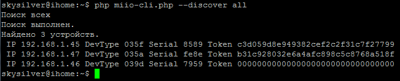

Можно не опрашивать все устройства в сети, а отправить запрос адресно на конкретный IP:
```
php miio-cli.php --discover 192.168.1.47 --debug
```
Помимо консольной утилиты `miio-cli.php` можно воспользоваться кросс-платформенным приложением **Packet Sender** или аналогичными утилитами для смартфонов (например **Packet Handler** для андроида). В качестве отправляемого сообщения указать `21310020FFFFFFFFFFFFFFFFFFFFFFFFFFFFFFFFFFFFFFFFFFFFFFFFFFFFFFFF`. Остальные настройки наглядно представлены на скриншотах.

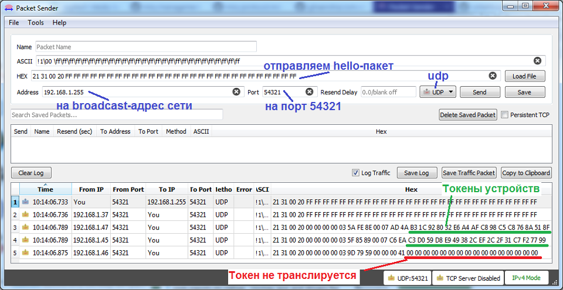
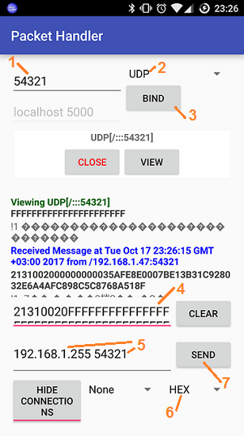
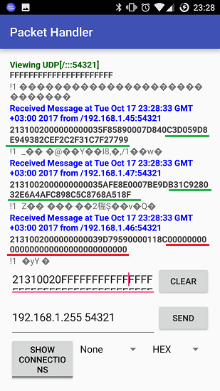

### 2.  База данных и кеш-файлы Mihome
На андроид смартфоне с рутом в папке `/data/data/com.xiaomi.smarthome/databases/` нужно найти файл базы данных приложения **miio2.db** и скопировать его в любую пользовательскую папку. Затем с помощью приложения **aSQLiteManager** открыть эту базу и в таблице **devicerecord** найти столбец **token**. В нем и будут токены всех устройств.

Чтобы скопировать файл базы данных на нерутованных смартфонах, нужно включить режим USB-отладки и подключиться по ADB. Затем в консоли ADB сделать резервную копию приложения Mihome командой
```
adb backup -noapk com.xiaomi.smarthome -f backup.ab
```
Полученный архив распаковывается java-утилитой **ADB Backup Extractor**
```
java.exe -jar abe.jar unpack backup.ab backup.tar
```
Файл `backup.tar` открываем обычным архиватором (**7-zip**) и ищем там базу `miio2.db`. Для просмотра базы на ПК можно воспользоваться **SQLite browser**.

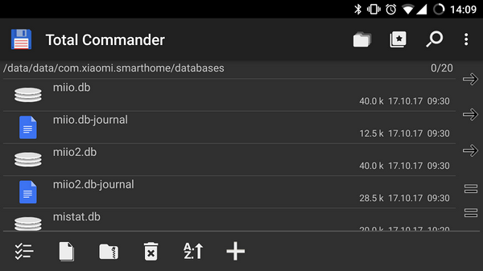
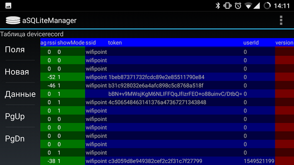

Аналогичную процедуру можно выполнить с помощью утилиты **MiToolkit**. Суть та же, что и через ADB, только через windows-приложение, чтобы не ковыряться в консоли.

Условия:
1. Установленные на ПК ADB-драйвера смартфона.
2. Установленная на ПК Java.
3. На смартфоне включена отладка через USB и разрешено подключение с ПК.
4. И, разумеется, смартфон подключен по USB к ПК.

Скачиваем на ПК утилиту [MiToolkit 1.5](https://github.com/ultrara1n/MiToolkit/releases/download/1.5/MiToolkit.1.5.zip) и распаковываем архив. Запускаем `MiToolkit.exe`.

Переключаем на английский язык и нажимаем **Extract Token**.

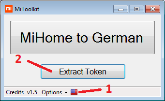

Появится окно с описанием процесса. В нем снова нажимаем **Extract Token**.
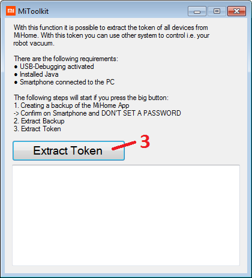

Через некоторое время на телефоне запустится приложение **Mihome**, а на ПК появится предупреждение, что ни в коем случае не ставить пароль на резервную копию приложения Mihome. Нажимаем **ОК**.
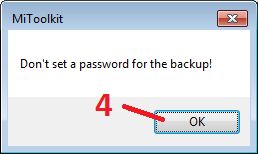

Далее на смартфоне появится сообщение о подтверждении создания резервной копии приложения **Mihome**. Оставляем поле ввода пароля пустым и тапаем **Создать резервную копию данных**.
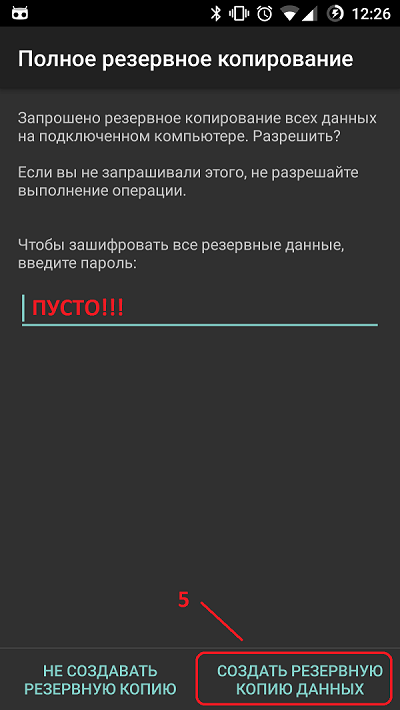

После успешной архивации на ПК появится соответствующее сообщение. Нажимаем **ОК** и ждем результата.
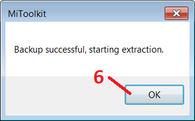

По окончанию экспорта устройств из базы приложения в основном окне будет заполнено соответствующее поле. Если устройство много, то нужно прокрутить список вниз. Полоса прокрутки при этом не отображается.
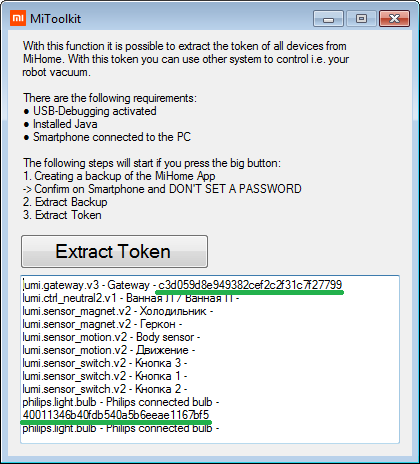


Кроме того, на рутованных смартфонах токены также можно найти в файлах кеша `/data/data/com.xiaomi.smarthome/cache/smrc4-cache`. Например, через тот же ADB это выглядит так:
```
adb root
adb shell
cd /data/data/com.xiaomi.smarthome/cache/smrc4-cache
grep -nr token .
```

### 3. Сброс устройства и последующая инициализация
Здесь все то же самое, что и в первом варианте. За исключением того, что предварительно нужно подключиться к открытой точке доступа, которую создает не настроенное miIO-устройство, и выяснить какие IP-адреса выданы.
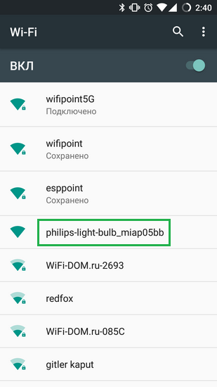


### Ссылки
  *	https://github.com/aholstenson/miio
  *	https://github.com/rytilahti/python-miio
  *	https://github.com/OpenMiHome/mihome-binary-protocol
  *	https://github.com/marcelrv/XiaomiRobotVacuumProtocol
